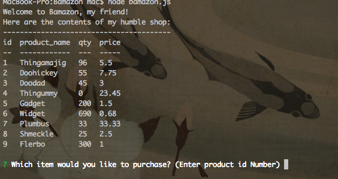
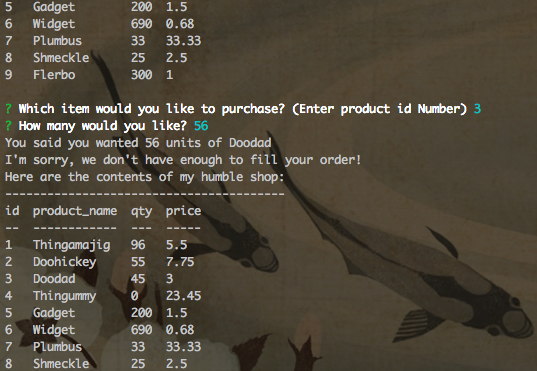
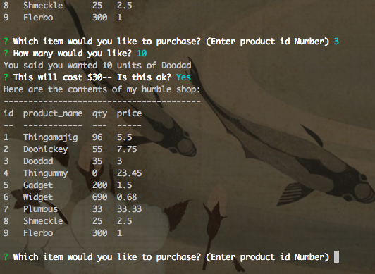

Here are muh Screens BRAH!

Screen 1: Initial interface:

Screen 2: What happens if you request more than is in stock:

Screen 3: What happens if you request an amount that can be fulfilled by the shop, including proof that the quantity on hand is altered:

I did not do the more advanced portions of this assignment, it was kind of a crazy week, sorry.

Thanks friends.